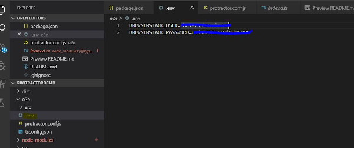

# Protractor Testapp

The main purpose of this application is to demonstrate Protractor and how to add and use parameters and variables in the setup of e2e tests.

This project was generated with [Angular CLI](https://github.com/angular/angular-cli) version 8.3.22.

## Requirement

* Install NodeJS globally - https://nodejs.org/en/download/
* Install Angular CLI globally  
    ```npm install -g @angular/cli```
* Install Protractor  
    ```npm install -g protractor```
* Firefox browser

( The installation of protractor is not mandatory. It can be used directly from this project npm packages. 
But I will assume it is installed globally which means the path to protractor in node_modules is not used )

## Setup and get dependencies

Clone the project and run  
    ```npm install```

## Build

Run `ng build` to build the project. The build artifacts will be stored in the `dist/` directory. Use the `--prod` flag for a production build.

## Development server

Run `ng serve` for a dev server. Navigate to `http://localhost:4200/`. The app will automatically reload if you change any of the source files.

## Running end-to-end tests

### Protractor setup

Protractor setup in this repository can be used to run Firefox and Chrome locally.<br />
Browserstack configuration for all other devices and browsers.<br />
Npm package puppeteer is added to the project. This package contains latest Chromium and removes compability issues.<br />
When running tests locally, Chromium from Puppeteer package will be used. <br />
For Firefox local installation is mandatory.

#### Variables
Variables and parameters added : <br /><br />

HEADLESS - Run tests in headless mode<br />
FIREFOX - run tests in Firefox<br />
CHROME - Run tests in Chrome (default)<br />
CHROME_BIN - Chromium browser<br />
BROWSERSTACK - Run remote at Browserstack<br />
DEBUG - run in debug mode<br />
dotEnv - package for using ENV variables for e.g. passwords<br />
SELENIUM_PROMISE_MANAGER - Turn off Selenium promise manager<br />
suites - Run different test suites

#### Useful commands

* Running locally with Angular :

`ng e2e` (CLI) to execute the end-to-end tests via [Protractor](http://www.protractortest.org/).<br />
Server should not be running. Command will launch internal Chromium and run tests<br /><br />
`protractor .\e2e\protractor.conf.js` to execute the end-to-end tests with Protractor.<br />
Application server needs to be started by running `ng serve`. Command will launch internal Chromium and run tests<br /><br />
`protractor .\e2e\protractor.conf.js --firefox` to execute the end-to-end tests with Protractor.<br />
Application server needs to be started by running `ng serve`. Command will launch Firefox<br /><br />
`protractor .\e2e\protractor.conf.js --headless` to execute the end-to-end tests in headless mode with Protractor.<br />
Application server needs to be started by running `ng serve`<br /><br />
Commands can be added to `package.json` for simplified execution e.g. firefox headless example<br />
"firefox": "protractor e2e/protractor.conf.js --firefox --headless"<br />
Can be executed by running `npm run firefox` and it will run Firefox tests in headless mode<br /><br />
To run test suites use parameter `--suites` e.g. `--suite first`<br />
* Running remote with Browserstack :

__IMPORTANT:__ To be able to run towards Browserstack an account is needed.<br /><br />
<br /><br />
You need to create a file named `.env` in /e2e directory and the parameters: <br />
* BROWSERSTACK_USER (username)
* BROWSERSTACK_PASSWORD (API-key)<br /><br />
Connection needs to be open by running:<br />
`./BrowserStackLocal.exe --key <your_API_key> --force-local` <br /><br />
Parameter `--browserstack` shall be used to run the tests. <br />
`protractor .\e2e\protractor.conf.js --browserstack`<br />
Browsers and devices shall be added in the `multiCapabilities` section in `protractor.conf.js`


## Running unit tests

Run `ng test` to execute the unit tests via [Karma](https://karma-runner.github.io).

